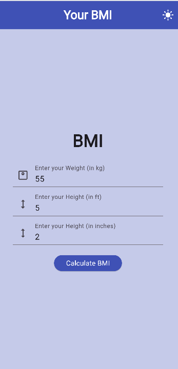
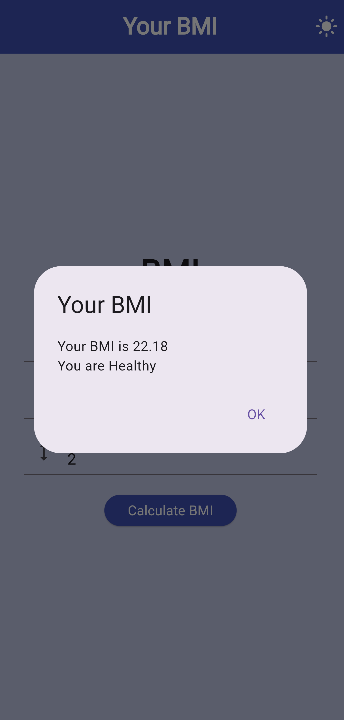
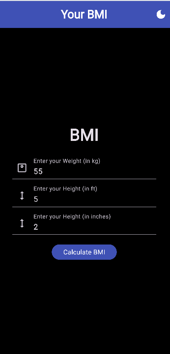
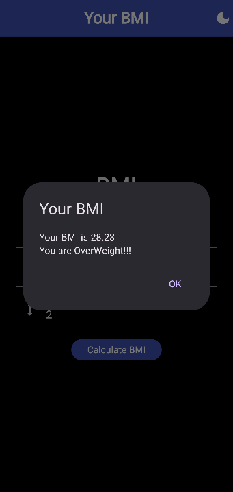

# BMI Calculator App – Flutter

[](https://flutter.dev)
[](LICENSE)
[](https://flutter.dev/docs/development/data-and-backend/state-mgmt/simple)

A clean, responsive, and cross-platform **BMI Calculator App** developed using **Flutter** and **Dart**. This application enables users to calculate their BMI using weight (in kilograms) and height (in feet and inches), providing categorized health feedback based on the result. The app includes a modern Material Design interface with both **light and dark themes**.

---

## 📱 Features

- 🔢 **BMI Calculation**: Compute BMI based on metric inputs (kg, ft/in)
- 🌗 **Theme Toggle**: Light/Dark theme switch using Flutter’s `ThemeData`
- 💡 **Interactive UI**: Clean layout with Material Components
- ✨ **Input Validation**: Ensures all fields are filled before calculating
- 📊 **Health Feedback**: Displays BMI with classification (Healthy, Overweight, Underweight)

---

## 🛠️ Tech Stack

| Technology  | Usage                                  |
|-------------|----------------------------------------|
| Flutter     | Cross-platform app development         |
| Dart        | Programming language                   |
| Material UI | UI widgets and layout                  |
| setState    | Local state management                 |
| ThemeData   | Light/Dark theme configuration         |

---

## 📸 Screenshots

### Light Theme




### Dark Theme




## 🚀 Getting Started

### 🔧 Prerequisites

- [Flutter SDK](https://flutter.dev/docs/get-started/install)
- Android Studio / VS Code / Xcode

---

### 📁 Folder Structure

```bash
├── lib
│   ├── main.dart         # App entry point with theme toggle
│   ├── bmi_calc.dart     # UI and BMI logic
│   └── theme.dart        # Light and dark theme definitions


